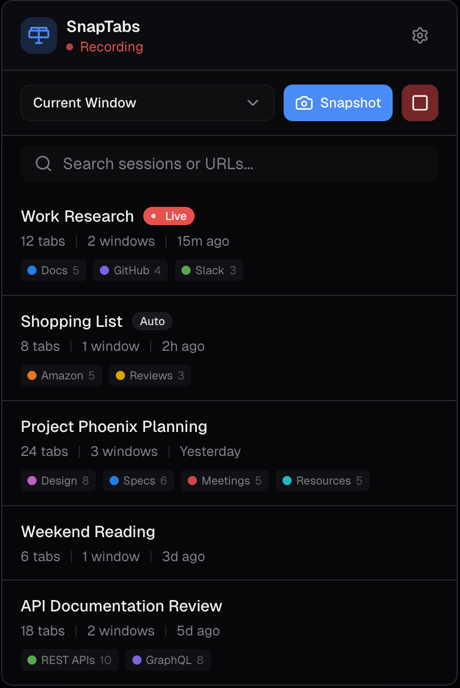
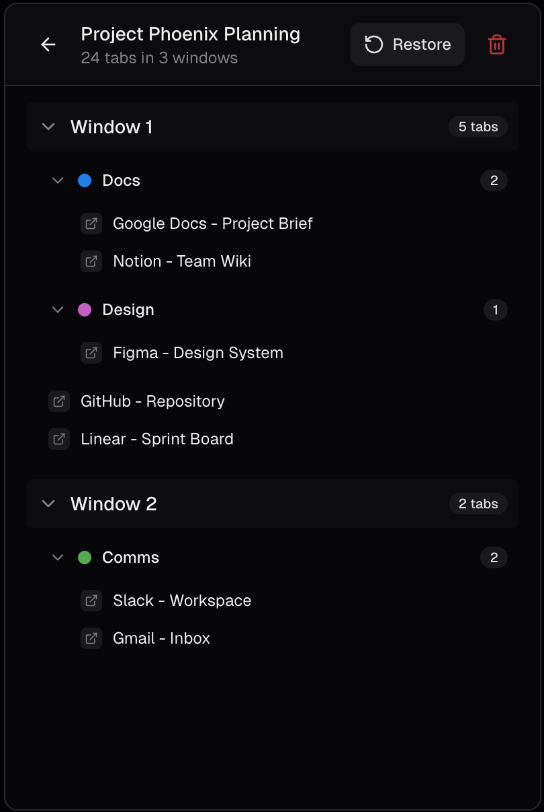

# SnapTabs - Save and Restore Browser Tabs

Save every tab in your Chrome window with one click, then bring them all back days or weeks later. SnapTabs keeps tab groups intact, handles incognito tabs, and stores everything on your own machine. No accounts, no sync, no tracking.

[](https://chromewebstore.google.com/detail/cgkpmhbpejmdjgeipmkbihbjcniflpnl)

## What it does

SnapTabs is a Chrome extension that captures the state of your tabs and saves them as named sessions. You can have a "Monday standup" session with 12 tabs, a "React project" with 40 tabs, and a "Tax research" you haven't touched in six months. One click restores any of them.

The point is not to keep 200 tabs open. The point is to close them without losing them.

## At a glance

| | |
|---|---|
| Latest version | 1.3.1 |
| Browser | Chrome 93+ |
| Manifest | V3 |
| Storage | Local only. No cloud sync |
| Permissions | 4 (tabs, tabGroups, storage, contextMenus) |
| Network requests | None |
| Price | Free |
| License | MIT |
| Size quota | 10 MB (configurable max-sessions 1 to 500) |

> The Chrome Web Store badge above updates automatically after each published release. Until a new version passes CWS review, the badge may lag behind this repo's source version.

## Features

### Core

- **Snapshot tabs** from the current window or every window with one click.
- **Tab group preservation** keeps the group name, color, and collapsed state.
- **Incognito support** when the extension is permitted in incognito mode.
- **Search** across session names, tab titles, and URLs.
- **Keyboard shortcut** `Alt+Shift+S` saves a snapshot without opening the popup.
- **Right-click menu** on the toolbar icon for a quick "Save all tabs".

### Added in recent releases

- **Auto-snapshot on browser close.** Quit Chrome with Cmd+Q or close the last window and your tabs are waiting for you on the next launch. Multi-window quits are captured as a single combined session.
- **Session pinning.** Pin the sessions you use often so they stay at the top and survive auto-pruning when you hit the storage limit.
- **Omnibox search.** Type `st` in the address bar, press space, then type a query to search every tab across every saved session without opening the popup.
- **Import and export.** Download all sessions to JSON or load them from a previous export. Useful for moving between machines or keeping an off-device backup.

### Also available

- Live recording that captures new tabs as you open them, with URL deduplication.
- Configurable max-sessions limit with auto-pruning of the oldest auto-saves first.
- Restore into the current window or a fresh one, with optional auto-delete after restore.
- Storage usage bar in settings so you can see where you are against the 10 MB quota.

## Screenshots

| Main view | Session detail | Settings |
|---|---|---|
|  |  |  |

## FAQ

### Is any of my data uploaded?

No. Everything is stored in `chrome.storage.local` on your device. There is no cloud sync, no backend service, no analytics. The extension does not make outbound network requests.

### What happens to my tabs if Chrome crashes?

Turn on **Settings > Auto-Save > Save on browser close** (off by default). While it's on, your tabs are captured as the last window closes and saved as a session named "Browser close". On next launch, open the SnapTabs popup and restore it.

A hard crash that kills the service worker before the save completes can lose the most recent snapshot. For critical tab sets, take a manual snapshot (`Alt+Shift+S`).

### Does it restore tab groups correctly?

Yes. Pinned tabs come back pinned. Tab groups come back with their original name, color, and collapsed state. The only thing SnapTabs cannot restore is the exact window layout, because Chrome does not expose window geometry to extensions.

### Can I sync sessions between devices?

Not automatically. Sessions stay on the device where they were created. Use **Settings > Data > Export** to download a JSON file, then **Import** it on another machine.

### How is this different from "reopen closed window" in Chrome?

Chrome's built-in history is time-limited, hard to search, and does not let you name or organize anything. SnapTabs gives you named, searchable, persistent sessions that survive Chrome restarts and updates.

### Why isn't there cloud sync?

Because adding a backend means handling your browsing data on somebody's server. SnapTabs is deliberately local-only. If you need cross-device sessions, export to JSON and share the file through a channel you already trust.

### Does it work with Firefox or Edge?

The current build targets Chrome MV3. It works in Chromium-based browsers that support MV3 (Brave, Arc, recent Edge). Firefox support would need a separate build because Manifest V3 differs on Firefox.

## Install

### Chrome Web Store

[Install SnapTabs from the Chrome Web Store.](https://chromewebstore.google.com/detail/cgkpmhbpejmdjgeipmkbihbjcniflpnl)

### From source

```bash
git clone https://github.com/threatner/SnapTabs.git
cd snaptabs
npm install
npm run build
```

Then load the build:

1. Open `chrome://extensions`
2. Enable Developer mode (top right)
3. Click "Load unpacked"
4. Pick the `.output/chrome-mv3` directory

## Development

```bash
npm run dev            # dev server with hot reload
npm run build          # production build
npm run zip            # package a .zip for distribution
npm test               # unit tests (Vitest)
npm run test:watch     # unit tests in watch mode
npm run test:coverage  # coverage report
npm run test:e2e       # E2E tests (Playwright, requires build first)
npm run test:e2e:debug # E2E tests in debug mode
```

## Tech stack

- [Svelte 5](https://svelte.dev) for the UI
- [WXT](https://wxt.dev) for the MV3 build system
- [Tailwind CSS 4](https://tailwindcss.com) for styles
- [TypeScript](https://www.typescriptlang.org) for type safety
- [Vitest](https://vitest.dev) for unit tests
- [Playwright](https://playwright.dev) for E2E

## Architecture

```
Popup (Svelte UI)  ──sendMessage──►  Background (Service Worker)
                                          │
                                     Chrome APIs
                                   (tabs, windows,
                                    storage, tabGroups)
```

All tab-creating operations go through the background service worker via `chrome.runtime.sendMessage`. The popup sends a request and closes as soon as Chrome focuses the new tab; the real work finishes in the background.

Storage is split between `chrome.storage.local` (persistent sessions and settings) and `chrome.storage.session` (ephemeral state including live recordings, window map, proactive tab cache, and the pending-close buffer).

## Project structure

```
src/
├── assets/             # SVG icon source
├── components/         # Svelte UI components
├── entrypoints/
│   ├── background.ts   # Service worker: message handler, events, omnibox
│   └── popup/          # Extension popup (Svelte app)
├── lib/
│   ├── types.ts        # Interfaces, constants, helpers
│   ├── storage.ts      # Chrome storage CRUD (sessions, settings, caches)
│   └── tabs.ts         # Tab capture and restore logic
└── public/
    └── icon/           # Extension icons (16, 32, 48, 128 PNG)
tests/                  # Unit tests (Vitest)
├── setup.ts            # Chrome API mocks
├── types.test.ts
├── storage.test.ts
└── tabs.test.ts
e2e/                    # E2E tests (Playwright)
├── playwright.config.ts
├── fixtures/           # Browser + extension launch fixture
├── helpers/            # Storage seeding utilities
└── tests/              # Test specs
```

## Permissions

| Permission | Reason |
|---|---|
| `tabs` | Read open tabs, create tabs when restoring |
| `tabGroups` | Preserve and recreate tab group names, colors, state |
| `storage` | Store sessions and settings on your device |
| `contextMenus` | "Save all tabs" right-click item on the extension icon |

No network, no history, no cookies, no identity. Full detail in [PRIVACY.md](PRIVACY.md).

## Contributing

See [CONTRIBUTING.md](CONTRIBUTING.md).

## License

[MIT](LICENSE)
